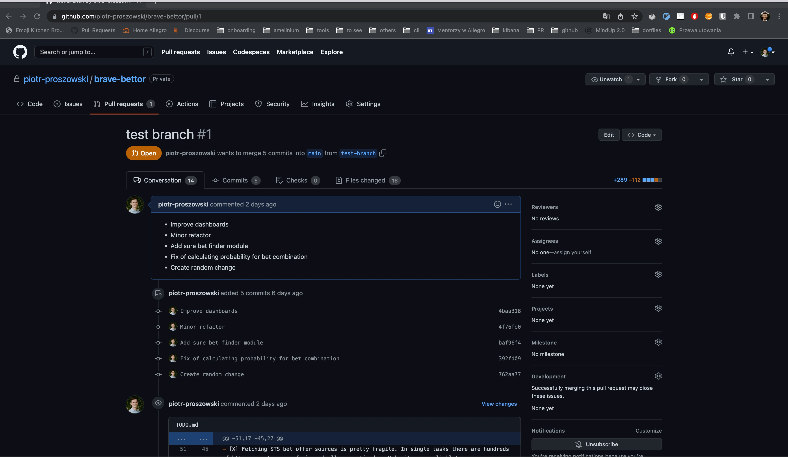

#  Github Todo List

## Github Todo List
Bitbucket's [pull-request-tasks](https://bitbucket.org/blog/introducing-pull-request-tasks) substitute. 

When I receive comments on my pull request I like to go through them and create to do list. For example `- [ ] fix typo` or `- [ ] discuss this concept offline`. From time to time this list happens to be pretty big - especially when changes I propose are controversial. For this cases `Github Todo List` has been created. It gathers all those to do list items and help with navigating through them.

## Demo

## Install

Extension is not yet in Chrome Webstore - review is still pending. 

However, you can easily install extension in developer mode: https://bashvlas.com/blog/install-chrome-extension-in-developer-mode/

For those who trust me and don't want to bother with build itself - I added release with zip file so you don't need to build it yourself.
You can create such `.zip` by yourself by typing `npm run build`.

## Contribution

Suggestions and pull requests are welcomed! I'm not a frontend expert so I'm pretty sure there is a lot of room for improvement :) 

## Credits:
- [Mahmoud El Hakim](https://codepen.io/elhakimdev) for [beautiful pure CSS To Do List](https://codepen.io/elhakimdev/pen/qVyqvB)
- [Hover.css](https://ianlunn.github.io/Hover/) for animation on hover

- [Chrome Extension CLI](https://github.com/dutiyesh/chrome-extension-cli) for bootstraping this project

